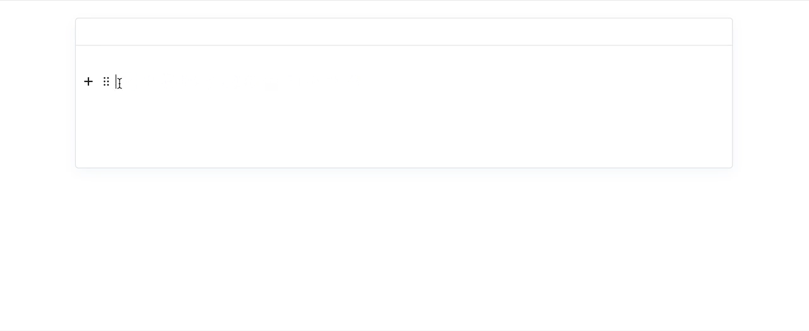

# EditorJs - Codeflask

> [!WARNING]
> This repo is depreciated / archived.

> [!IMPORTANT]
> Due to changes in the core editor (Change from codeflask -> codecup) I have decided to fork this repo, and depreciate it.
>
> The Plugin originally relied on [CodeFlask](https://kazzkiq.github.io/CodeFlask/), which i have also forked, and republished as [CodeCup](https://github.com/calumk/codecup)
>
> As such, the plugin is now different enough, that i have decided to republish it under its new name, so I can accept issues/pull requests on the whole stack, and maintain it better going forwards
> 
> Please upgrade to [@calumk/editorjs-codecup](http://github.com/calumk/editorjs-codecup)


---

### NPM
    npm i @calumk/editorjs-codeflask

### JS
    https://cdn.jsdelivr.net/npm/@calumk/editorjs-codeflask@latest

---

## About

This is an EditorJs wrapper for [CodeFlask](https://kazzkiq.github.io/CodeFlask/) - A lovely lightweight zero-dep code formatter

It was built to be an improvement on :
* https://github.com/editor-js/code - Too Basic
* https://github.com/dev-juju/codebox - Agressive styling, and exports more data than markdown can handle


## Demo




## Built with:

* [CodeFlask](https://kazzkiq.github.io/CodeFlask/)
* [Prism](https://www.npmjs.com/package/prismjs)
* [Prism ESM Importer](https://www.npmjs.com/package/prismjs-components-importer)
* [Nice Select 2](https://www.npmjs.com/package/nice-select2)


---

## Installation / use

```javascript
import EditorJS from '@editorjs/editorjs';
import editorjsCodeflask from '@calumk/editorjs-codeflask';

var editor = EditorJS({
  // ...
  tools: {
    ...
    code : editorjsCodeflask
  },
});
```


## Data Format
The data imported/exported from the block is as follows:

| Name                       | Description                                                                                                              |
| -------------------------- | ------------------------------------------------------------------------------------------------------------------------ |
| code                       | The code that is displayed in the editor, with line breaks                                                               |
| language (optional)        | The programming language                                                                                                 |
| showlinenumbers (optional) | Will show/hide the line numbers (Default true) (WIP - [Codeflask #132](https://github.com/kazzkiq/CodeFlask/issues/132)) |


Since language and linenumbers are optional, existing ```code``` blocks can safley use this plugin


<!-- ---

## Markdown Compatability

> TODO!

This plugin *will be* compatible with

    npm i editorjs-markdown-parser

It will import/export using the code fence markdown style, with the language printed imediatly after the first fence, as described in [GFM #117](https://github.github.com/gfm/#example-112)

Line-numbers cant be expressed in markdown, so will be ommited

Example :

    ```javascript
    \\ Hello World
    ``` -->
